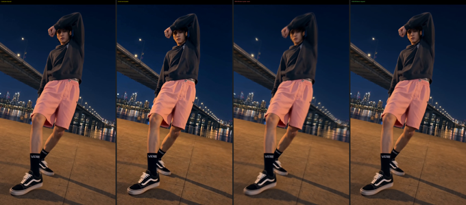

<!-- Language: **🇰🇷 한국어** · [🇺🇸 English](README.en.md) -->

# seam-fixer

**생성 모델로 이어 만든 영상 클립들의 이음새(경계)를 지웁니다.** 모델 없이(정렬) + 학습 보간으로.

```
A ──┐  seam  ┌── B ──┐  seam  ┌── C ──┐  seam  ┌── D
    ▼        ▼       ▼        ▼       ▼        ▼
 [ 비율·색·노출·샤프니스·라이팅 드리프트 + 중복 freeze 프레임 ]
                    │  seam-fixer
                    ▼
A ─────────────────────────────────────── D   (하나의 연속 촬영본처럼)
```

## 문제
이어 생성(A→B→C→D, 각 클립은 **이전 클립 끝 프레임을 조건**으로 생성)한 뒤 이어 붙이면 컷마다 화면이
살짝 **줌되며 튀고**, **색·노출이 깜빡**이고, 순간 **멈칫**한다. 원인은 클립별 **비등방 스케일(가로≠세로)
+ 색/노출/샤프니스/라이팅 드리프트**(체인 따라 누적) + `B[0]≈A[-1]`인 **중복 freeze 프레임**.



> 위: `A_last`·`B_first`(거의 동일). 아래: 둘의 차이 ×5 — RAW(왼쪽)는 배경 엣지까지 온통 빛나 이음새가
> 드러나고(0.032), 정렬 후(오른쪽)엔 배경이 사라지고 **사람 윤곽만**(0.013) 남는다 = 2부 보간이 맡는 몫.

## 동작 (2단계)

**1부 · 정렬 (결정론적).** 모든 클립을 **첫 클립 기준 공간으로 누적 매핑** → 컷 양쪽이 같은 공간이라
이음새가 맞고 다음 컷도 안 깨진다(국소 보정은 클립 꼬리를 바꿔 다음 컷을 깸). 클립마다:
- **기하** — full affine(가로/세로 독립 스케일; 비등방이라 similarity로는 안 됨), **정지 배경만** 매칭(피사체 제외)
- **색·노출**(채널별 mean+std) · **샤프니스**(고주파 매칭) · **라이팅**(공간가변 저주파 게인, 피사체 마스킹)
- **중복 프레임 제거** → freeze를 정상 모션으로. 생성이 경계에서 **K프레임 겹쳤으면 `--overlap K`**
  (K장 버리고 정렬은 `prev[-1]↔next[K-1]` 대응쌍으로 — 오히려 더 정확). 기본 1, 0이면 안 버림,
  **`--overlap auto`면 경계별로 K 자동 검출**(몇 개 겹쳤는지 몰라도 됨).
- 모드: `tight`(경계 최대 매칭, 기본) / `balanced`(클립 자연스러움 우선)

**2부 · 보간 (학습).** 정렬 후 남는 건 `prev[-1]`↔`next[0]`가 다른 순간이라 생기는 **피사체 모션**뿐.
각 경계에 중간 프레임 K장을 합성해 부드럽게(`K=1`+중복제거 = 길이 보존).
- `rife`(권장) — 학습 보간(RIFE v4.26, `ccvfi`). 가림/빠른 손도 solid하게 복원.
- `flow` — RAFT 워프, 무의존. 작은 모션엔 충분하나 빠른 가림 부위는 잔상. (`ccvfi` 없으면 자동 폴백)

## 설치
```bash
pip install torch torchvision --index-url https://download.pytorch.org/whl/cu128   # GPU에 맞게
pip install opencv-python-headless imageio[ffmpeg] numpy flask
pip install ccvfi        # (선택) RIFE 보간 백엔드. 없으면 flow로 폴백. ffmpeg는 PATH에 필요.
```

## 사용
```bash
# 웹앱 (권장): 클립 순서대로 추가 → Run → 진행바 → 결과+경계 슬로우 재생
python webapp/server.py            # http://127.0.0.1:5000

# CLI
python scripts/chain_normalize.py A.mp4 B.mp4 C.mp4 D.mp4 --out out/ --mode tight
python scripts/chain_normalize.py 3 --interpolate 1 --interp-backend rife   # 샘플 + 2부 보간
```
```python
from vbf.normalize import normalize_chain
r = normalize_chain(["A.mp4","B.mp4","C.mp4","D.mp4"], "out/", mode="tight", interpolate=1, interp_backend="rife")
```
출력: `result_full.mp4`(전체 정규화본), `result_boundaries_slow.mp4`(각 컷 4× 슬로우, RAW∣FIXED).
클립은 첫 클립 해상도/fps 기준, 한 번에 하나씩 스트리밍(메모리 한정). 4×~290f 1080×1920 ≈ 80s(RTX 5090).

## 구성
```
vbf/normalize/chain.py   # 코어: 정렬(1부)+보간(2부)
vbf/interp/              # 보간 백엔드: flow(RAFT) + rife(ccvfi)
scripts/                 # chain_normalize.py(CLI) · eval_boundaries.py · interp_experiment.py
webapp/                  # Flask 서버 + UI
```

## 한계
- 체인당 하나의 연속 장면(공유 배경) 가정. 장면 전환(하드컷)은 범위 밖.
- 전역 클립 드리프트 보정(클립 내부 드리프트는 근사). 매우 크거나 심한 가림 모션은 `rife`도 완벽하진 않음.
- 모든 판단은 지표로 검증(SSIM·Lab ΔE·모션 baseline·downstream) — `scripts/eval_boundaries.py`.
